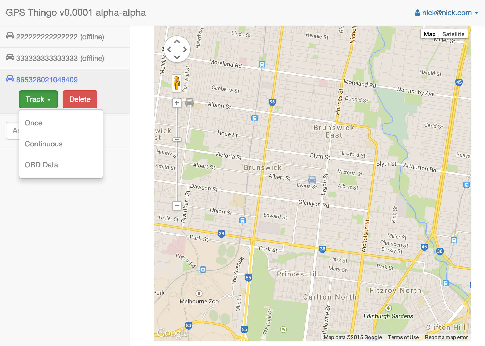

# GPS Tracker Server #
Manage and display locations of GPS trackers

## Why ##
My motorcycle was stolen, and I really wished I had a way to track it down.

I knew it had an OBDII port (like most cars, not so many bikes), which I had previously used to flash the ECU and log engine data, and thought, wouldn't it be good if it was fitted with a GPS tracker which just plugged into that (i.e. no cutting/soldering required).

I found just such devices (specifically the [Coban GPS306](http://www.coban.net/html/2014/07/23/2014072306120056640641.html)) available [on eBay](http://www.ebay.com/sch/i.html?_from=R40&_trksid=p2047675.m570.l1313.TR11.TRC1.A0.H0.Xcoban+gps306&_nkw=coban+gps306&_sacat=0) for USD$60 and bought one.

By default the devices come configured to use [www.gpstrackerxy.com](http://www.gpstrackerxy.com/). That system is hosted by some unknown-to-me company in China, plus you only get 30 days free access, which didn't appeal to me.

The other open source solutions out there looked ugly, heavy, clunky, so I made my own.

So the primary use case was: "as myself, I want to find where my bike is, so that I can get it the hell back" =)

## Overview ##
GPS Tracker Device <--> Device Gateway <--> MongoDB <--> REST API <--> Web Frontend

### Devices ###
These devices use GPRS (so you need a SIM with some credit) to talk over the net to an admin server (TCP or UDP).
The protocols are pretty simple strings containing commands (e.g. send me your location) and responses (e.g. my location is lat.x long.y)

You configure them by sending an SMS
e.g. to tell my device to use my home gateway, I sent it an SMS containing "adminip8888 59.167.194.249 9000" (9000 is the port)

### Device Gateway ###
TCP socket server using gevent, [mongoengine](http://mongoengine.org/) for ODM/ORM

The gateway can send commands to the devices (mongodb is used to store these, as well as all other data)

### REST API ###
Then there's a REST API ([python flask](http://flask.pocoo.org/), [mongoengine](http://mongoengine.org/) for ORM/ODM) talking to the DB

I did initially try Eve-mongoengine and flask-mongorest. Though they were great to quickly get basics up, I found them too restrictive. Plus for Version Zero I only needed a few endpoints quickly knocked up.

### Web Frontend ###
Angular, Bootstrap, Jade, Sass, Bower, Gulp

## Current Status ##
Currently the device gateway handles device initialization, heartbeat, and location request/response.

Now I have the basics working (location request/report/view on map), I've stopped active development. The main reason for this is that I can't see they system being widely useful to myself or others (I now keep my bike locked in the garage). Still, it was a fun thing to do.

Currently only works for the [Coban GPS306](http://www.coban.net/html/2014/07/23/2014072306120056640641.html), since that's what I bought.

Though the system is architected with the intention that adding support for other devices be reasonably straightforward.

For anyone interested, the other things I thought would be cool to do are on [the Trello board](https://trello.com/b/yqAj7edK/gps-thingo)

## Server Setup ##
This is very shorthand and assumes you're familiar with the stuff in use.

Using virtualenv recommended = no system-wide packages
* `mkdir venv && virtualenv venv/gps`
* `. venv/gps/bin/activate`
* `pip install -r requirements.txt`

## Running the Device Gateway ##
Nothing fancy yet!
* `. venv/gps/bin/activate`
* `./device_gateway.py`
Should now be listening on port 9000

## Trying the Device Gateway ##
In another tab: `cat sample-reqs/tkip102-1.txt | nc localhost 9000`

## Running Tests ##
With virtualenv activated, from repo root just run 'nosetests'

## Screenshot ##

## Links ##
* (Collection of docs on the GPS tracker devices by Barbu Dor)[https://drive.google.com/drive/u/0/#folders/0B9QofkYKWsMuZnIwZ1BqeXhzQlE] (thanks Barbu!)
* [Trello board for this project)[https://trello.com/b/yqAj7edK/gps-thingo]
* (TK103 GPS Tracker)[http://en.wikibooks.org/wiki/TK103_GPS_Tracker]
* (Traccar)[http://www.traccar.org/] - much more fully-fledged open source server, Java
* (my-GPS)[http://www.my-gps.org/index-en.php] - free hosted solution (web signup didn't work for me when I tried it ...) - PHP
* (OpenGTS)[http://opengts.sourceforge.net/OpenGTS_Config.pdf] - widely-used, open source, Java
